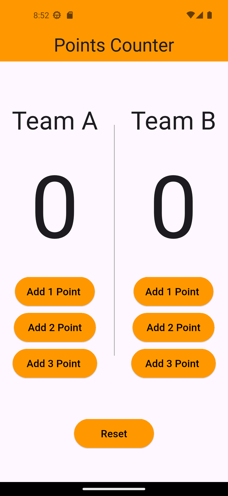

# 🏀 basketball_counter_app

Flutter app for counting basketball points for Team A and Team B, with a responsive UI.  
Built using **MVVM architecture** and **Bloc (Cubit)** for state management.

---

## 🎬 Preview

- Launches directly to Home Page with full score tracking UI for both teams.

---

## 📸 Screenshots

| Main UI |
|---------|
|  |

---

## ✅ Features

- 🧠 MVVM + Bloc (Cubit) architecture.
- 🧼 Clean and modular widget design (`CustomTeams`).
- 🖥️ Fully responsive UI with `MediaQuery`.
- ➕ Add 1, 2, or 3 points to Team A or Team B.
- 🔄 Reset button to reset both scores.

---

## 🧠 Architecture

- ✅ MVVM structure (separates View, State, Logic)
- ⚙️ Bloc (Cubit) for state management
- 📐 MediaQuery used for responsive design across devices

---

## 🚀 Get Started

```bash
git clone https://github.com/AhmedMohamed195/Counters_App.git
cd Counters_App
flutter pub get
flutter run
